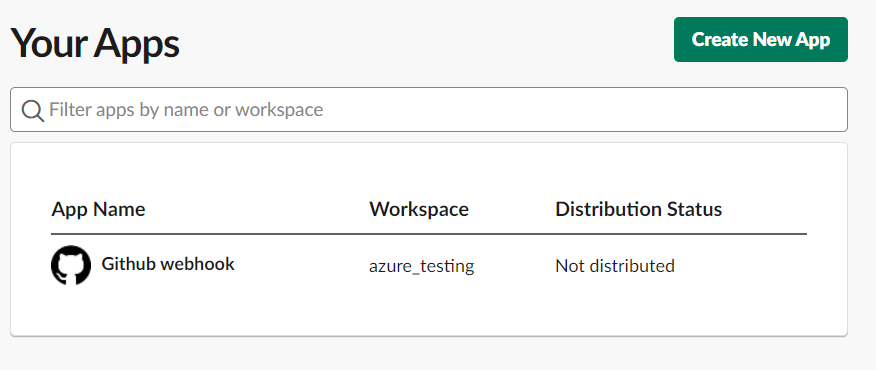
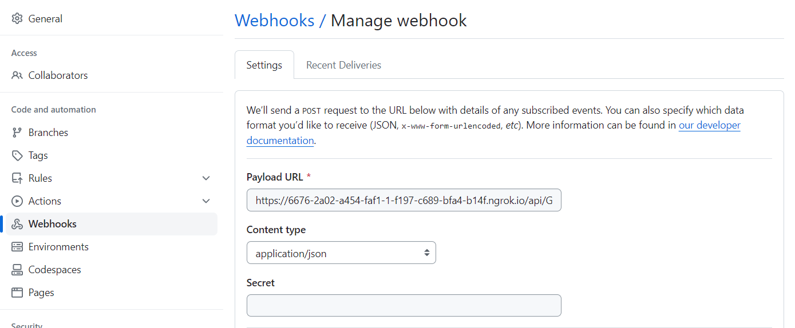
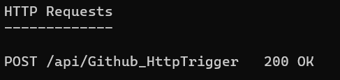
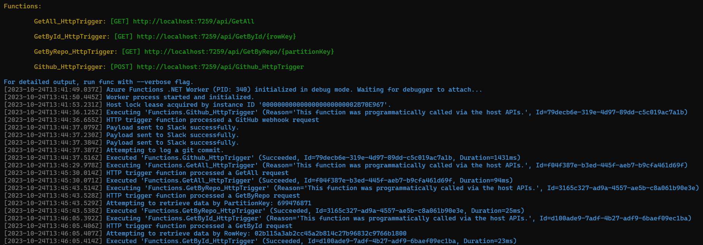
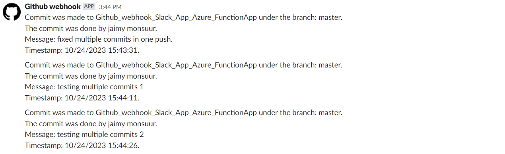
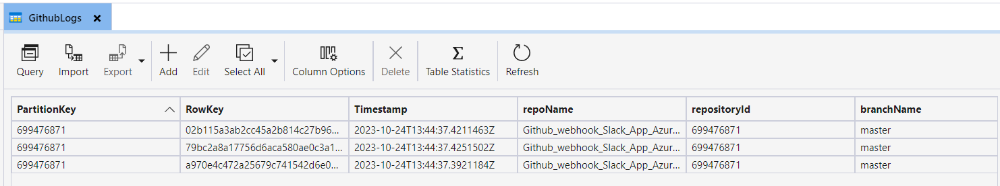

# Assignment 3: SlackChannel


## Jaimy Monsuur

**GitHub link:**

**[https://github.com/Jaimy-monsuur/Github_webhook_Slack_App_Azure_FunctionApp](https://github.com/Jaimy-monsuur/Github_webhook_Slack_App_Azure_FunctionApp)**

**Slack app**





Create a new slack app and select from** From scratch. **And add it to your workspace.


Select incoming webhook and add it to your workspace. You will get a secret key that you can use for the slack api. https://hooks.slack.com/services/xxxxxxxxxxx/xxxxxxxxxxx/xxxxxxxxxxxxxxxxxxxxxxx


**Github**





Create a github webhook and set the azure function url as the payload url. I used ngrok to test it.

**Application Set up**

For this application to work add the following to the local.settings.json(or add in azure configuration):


```
{
    "IsEncrypted": false,
  "Values": {
    "AzureWebJobsStorage": "UseDevelopmentStorage=true",
    "FUNCTIONS_WORKER_RUNTIME": "dotnet-isolated",
    "MyDatabaseConnection": "UseDevelopmentStorage=true", //URL here or use UseDevelopmentStorage=true for local testing using azurite
    "MySlackURL": "https://hooks.slack.com/services/xxxxxxxxxxx/xxxxxxxxxxx/xxxxxxxxxxxxxxxxxxxxxxx"
  }
}
```


**Results API**







**Results slack**





**Results table storage**




